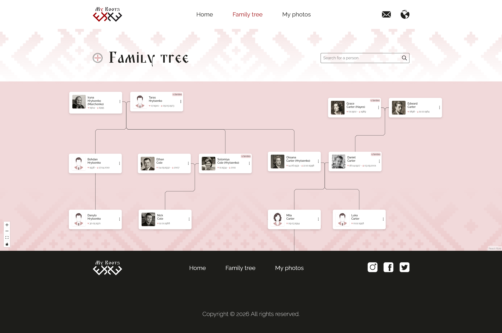
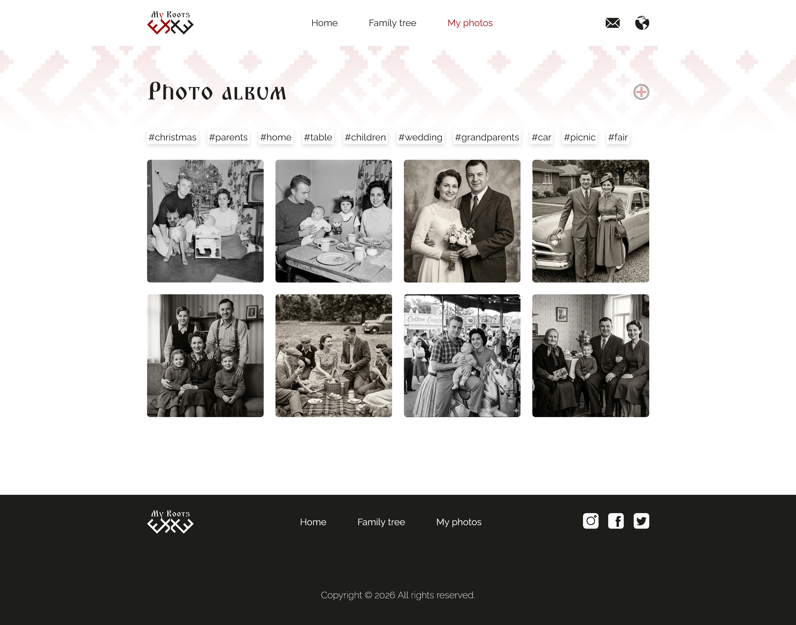

# My Roots

**My Roots** is a React + TypeScript web application for building and exploring a family tree through an interactive graph editor and a built-in photo album.

The project includes a landing page, a family tree page, and a photo album page. It was created as a personal portfolio project with a focus on UI design, structured data, and non-trivial frontend logic. The interface was designed in Figma and implemented in React.

[Live Demo](https://family-tree-mocha-zeta.vercel.app/)

## Screenshots

> Store screenshots in a `screenshots` folder inside the repository and link them like this:





## Features

- Interactive family tree visualization
- Search for people in the tree
- Add, edit, and manage people
- Add and edit relationships, including marriages
- Support for multiple spouses and active family branch switching
- Structured date input with date modifiers
- Basic JSON import and export for tree data
- Built-in photo album with tag-based filtering
- Add, edit, and delete photos
- Responsive design for desktop and mobile

## Tech Stack

- React
- TypeScript
- Redux Toolkit
- React Router
- React Flow
- ELK.js
- Vite
- CSS Modules
- ESLint
- Prettier
- Figma

## Project Overview

The application consists of three main parts:

- **Home page** — landing page presenting the project
- **Family tree page** — workspace for viewing, searching, and editing family relationships
- **Photo album page** — gallery for storing and organizing family photos

## Technical Focus

This project was built to practice and demonstrate:

- graph-based UI development
- working with connected and structured data
- handling complex family relationships in the interface
- combining editing workflows with visual graph rendering
- creating a polished custom UI from design to implementation

## Design

The visual style was inspired by vintage family archives: old photographs, album-like layouts, soft neutral tones, and decorative textile-inspired patterns.

## Getting Started

```bash
npm install
npm run dev
npm run build
npm run preview
npm run lint
npm run typecheck